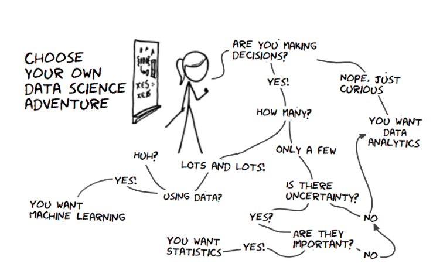

# Rockwall Analytics
## Data Science, Ushering in a New Age
## Authors RIHAD & SAMIRA

> We believe challenges present an opportunity to enrich the behavioural Ai toolbox with methods built for a complex, data-rich world. By envisioning our work as data scientists, we can shift the focus of our experimentation away from replication towards a more rewarding aim: empowering individuals, in all their cognitive and behavioural diversity, to make better decisions based on their own data and preferences. We have already seen this approach bearing fruit commercially, especially for innovative players in the tech sector, and we expect this to be widely emulated. Any firm seeking to fully use the individual-level data it holds will benefit from developing a combined behavioural and data science methodology

### Consumers
Many of us started our data science journey by marveling at simple, one-size-fits-all, impactful nudges rooted in academic psychology – for example, getting people to *pay their taxes on time or reduce their energy use*. But now competition for people’s attention in an increasingly digital world is heating up, many practitioners are focused on incremental improvements. In pursuit of these, they won’t want to restrict themselves to a single, uniform message. In many settings, the most effective approach will be multi-channel messages and choice architecture tweaks, mapped in potentially complex ways to micro segments of consumers. This kind of complexity is far from science fiction. ***The tools of data science allow us all to embrace this complexity, tame it and use it to our advantage***

In this world of increasing complexity, knowledge of the individual’s choice domain is going to become even more valuable than it already is. Why? For starters, the increase in **data** means there is simply more precise knowledge to be had. But perhaps more important are the challenges of replicability and generalisability. Here the devil is in the detail, or maybe more accurately: in the context. We now have plenty of evidence that were successful in one context cannot be lifted wholesale to another – no matter how similar the challenges may look through the lens of one’s preferred framework. This places a premium on understanding the context of the domain we’re trying to change as well as the individuals who operate within these varied contexts. This means recognising the diversity in people’s goals, as well as the societies and markets in which they’re embedded

Detailed knowledge of specific consumers in different contexts helps us understand why an intervention against malnutrition that worked in India did not *transport* well to neighbouring Bangladesh, for example. And this knowledge is not just helpful after the fact. When designing experiments we need the prescience to predict why our intervention may not work as intended and plan for making sense of any potential surprises. To begin with, making these predictions requires contextual knowledge on behavioural mechanisms and consumer types. In addition, we need to be able to identify and collect the right data during our intervention, so we can investigate after the fact why our intervention yielded the outcomes it did. If we understand why something worked or didn’t work, we can be much more efficient and targeted in refining our approach

We should not forget that, thanks to organisations’ substantial investments in data science, many data scientists already benefit from more and better accessible data on the consumer from which to glean these initial insights. Most data interventions these days already include a check for heterogeneous treatment effects after the fact – the possibility that a nudge’s impact varies systematically with consumer characteristics. But this is only the beginning

Today’s computing power allows organisations to run very data-heavy experiments, taking into account not only the usual consumer demographics but also a consumer’s previous responses to nudges and choice architecture tweaks. So-called persuasion profiling allows the firm to build up a picture of the types of nudges to which each consumer responds. Another rich source of information is the increasing number of digital self-monitoring and self-notification devices set up by consumers themselves. This is where data science can help infuse the process of data-driven engagement with more humanity, placing greater emphasis on individual preferences and less on the predictive power of demographic or behavioural data. The ultimate aim is to create a personalised ‘conversation’ that feels familiar, seamless and helpful to the consumer

### Employees
We are also seeing the emergence of a new ‘consumer’ for organisations that has become particularly salient in the COVID-19 world: the worker. We haven’t seen advances at the same pace as those that have been seen for the consumer world, which is likely due to distrust by workers with how this data will be used. Fortunately, albeit for unfortunate reasons, we have an opportunity to change this as there is a shift underway to empower virtual and flexible working styles permanently

We are at the start of a multi-year definition of the future of work which will leverage virtual interactions as the norm, flexible working styles and workforce redistribution both in terms of location and permanence. All of this points towards the ability to harness the data behind these interactions to enhance the way these interactions happen in the future at an individual level. And the understanding of domain context will be no less important in these applications than for the consumer

> By working with the organisation’s data scientists, we can help companies begin to unlock and interpret the patterns of behaviour against a clearly defined need: how to empower these individuals to function effectively in a virtual context. The next step in this journey is performance empowerment by providing individuals insights into their behavioural patterns through analysis of their emails, chats, calendars, platform interactions and other workplace tools. Behavioural informatics offers us a view into how this could be done

Insights can be personalised and delivered for the employee to help them maximise their well-being. For instance, this data could be used in conjunction with insights from bio markers like their Heart Rate Variability (HRV) on well-being to provide customised recommendations for when to do different types of work based on their optimal individual biorhythm. Or identify when they might be feeling disconnected by linking their personality to their communication patterns and stress level and suggest positive interactions based on prior behaviour. The result will be the quantified self at work, which will truly liberate the well-being of individuals. However, this will only be possible through the use of data science to deliver individualized interventions specific to the unique contexts in which these individuals are acting

The primary barriers to advancing this field are in the ethical use of the employee data by companies so this is not viewed as a *big brother* initiative. To break through, we need to first empower them by enhancing their well-being by letting them take control of their data and decide how it is shared, then focus on bettering their teams by identifying data which helps them function more effectively and only then start optimising the organisation with this data. A useful way we can start to think about this gradual transition is the *FORGOOD framework* from the public policy domain; this puts the emphasis squarely on empowering the individual’s and not the organisation’s desired behaviours. We also need to take great care to thoughtfully design the choice architecture for this environment so as to empower the employees and their teams with choice, not overload them

## Conclusion
If only half of the innovations we foresee in data science become a reality, it seems that tomorrow’s ***consumers and employees*** will be facing a deluge of digital nudges. When it comes to building sustainable engagement, these data-driven techniques will have to keep on improving their relevance, appropriateness and adaptability to personal tastes

Which brings us to an area where *Rockwall Analytics* can really boost the chances of data science success: leveraging data insights to help people make choices supported by algorithms. Increasingly so, algorithms are giving us excellent advice in both our personal and professional lives: when to exercise, how to spend our money, where to invest and so on. But just because the information is there, doesn’t mean people use it – a tough challenge, but one that is familiar to the data scientist

An additional twist to this challenge is the risk of cognitively overloading people – it's not just a question of which information to use but also the question of which algorithmic advice to follow. Building trust in the *right* algorithms will play a crucial part in empowering users. And the intersection of decision science and data science will have a major role to play in advancing this empowerment

The challenge of data science, as we see it, requires not only mastering the tools of data science to tame complexity, but also a further deepening of our knowledge of individuals with all their varied behaviours, preferences and contexts. If we can bring this knowledge into a new generation of behavioural interventions targeted at helping people, and firms make (and trust) data-driven decisions, we could usher in the new age of behavioural science AD (After Data)

